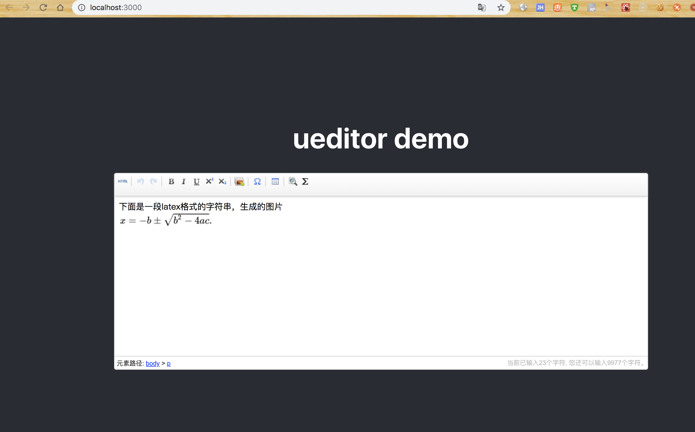

# 功能点

- ueditor in react
- latex格式数据在ueditor中以公式的形式展示，并且可以二次编辑

# 原理

1. 用mathjax将latex格式数据转换成svg
2. 用canvg将svg转换成图片
3. 将图片转换成kityformula格式的图片，在ueditor中展示
4. ueditor安装公式插件，二次编辑公式图片

# 技术栈

- [ueditor](https://ueditor.baidu.com/website/index.html)
- [ueditor 公式插件](https://ueditor.baidu.com/website/kityformula.html)
- [create-react-app](https://github.com/facebook/create-react-app)
- [mathjax](https://www.mathjax.org)
- [canvg](https://github.com/canvg/canvg)
- [drawLaTex](https://github.com/leeenx/drawLaTex)

# demo

